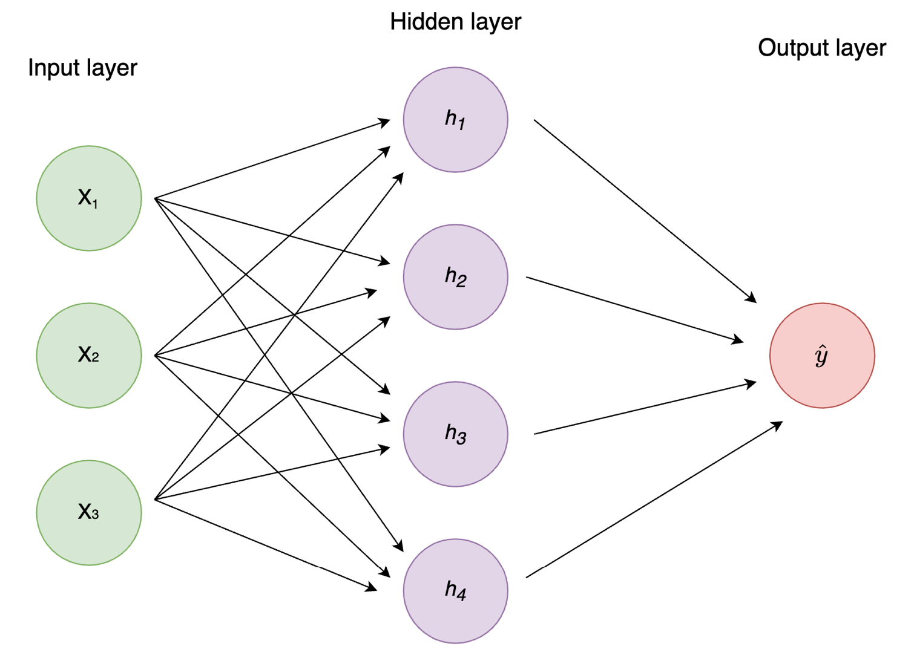
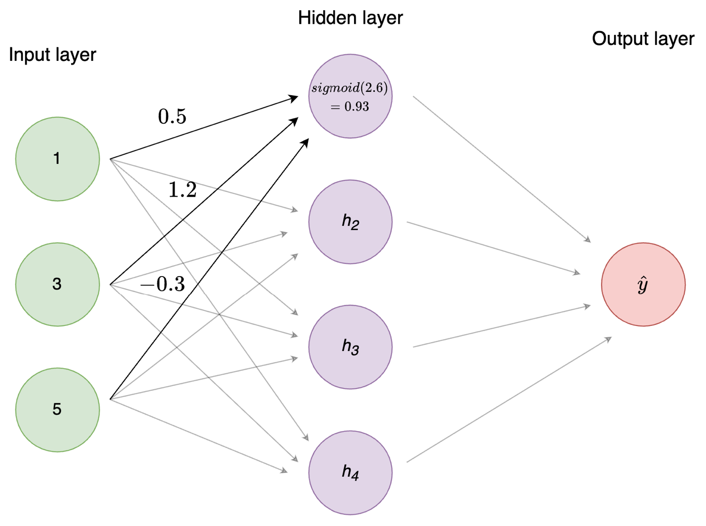
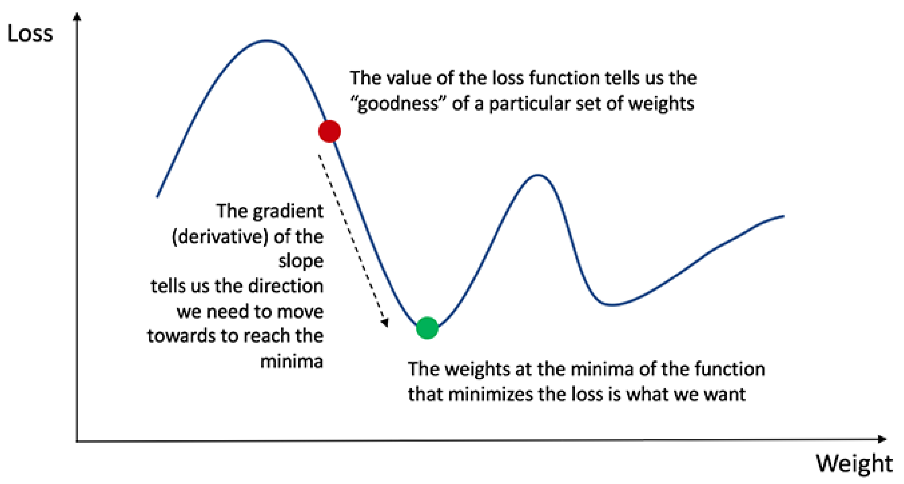
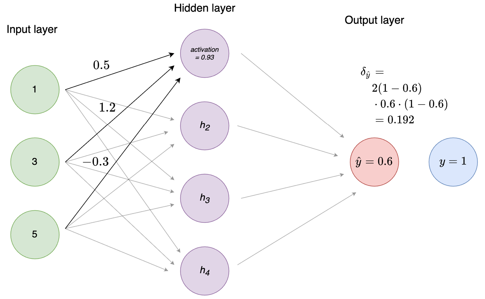
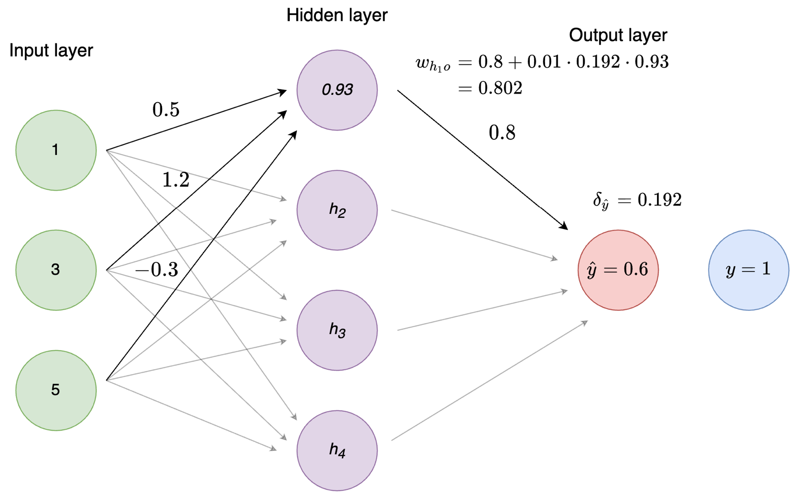

Neural networks (NNs) are all the rage right now and can seem kind of magical at times. In reality, most NNs are essentially just a bunch of logistic regressions^[Depending on activation function] stacked on top of each other and a clever way of distributing blame for the predictions and updating the weights accordingly. In this handout, we will break NNs down step-by-step to hopefully de-mystify. There are exercises along the way, but I suggest reading through the whole document before doing them to have a better understanding of the big picture. 

I have tried to minimize the math and keep linear algebra out of the way. Implementations of neural networks in libraries such as `torch`, `keras`/`tensorflow` etc. use matrix multiplications and other linear algebra instead of what I'll show you here^[Along with a whole bunch of other optimization.]. The reason for doing it this way, is that it, at least for me, is far more intuitive to see what happens at each individual node. Once you understand this, understanding how it's done with linear algebra is not as daunting.

Let's begin our journey by understanding __activation functions__.

## Activation functions

Consider a standard feedforward neural network (aka multilayer perceptron)

```{r mlp, echo=FALSE, fig.cap="Figure 1: Standard MLP", out.width="200%"}

```


This network takes 3 inputs (a row of 3 variables/columns in your data), has 4 hidden nodes, and a single output node which means it will output a single number. For regression and binary classification you use a single output node, and for multiclass classification you use an output node per group. 

Upon creation of the network, all weights between the nodes (i.e. the links/lines in the image) are initiated with a random value^[Not always the case, some of the more advanced NNs require sophisticated initialization schemes.]. When the networks get an input of training examples, the inputs are multiplied by the weights and fed to the next layer of nodes. In our case, each node in the hidden layer receives an input which is a vector of 3 elements: the input times the weight from each input node to the hidden node. Before the hidden node can propagate the signal forward, it has to aggregate it to a single number with a _non-linear_ function.^[This is crucial and what makes NN _universal function approximators_.] This is where the activation function comes in. 

Nowadays, ReLU (and its variants) is the most common activation function, but sigmoid is the OG. The equations are as follows:

$$ReLU = max(0, input)$$
$$sigmoid = \frac{1}{1+e^{-input}}$$
The input in the above equations refers to the _net input_ to the nodes, i.e. the weighted sum of all inputs. All the activation function does, is apply _some function_ to the net input. This becomes the node's _activation_ and is what is fed to the next layer of nodes in the network in exactly the same manner as from the input to the first hidden layer. 

Let's see a quick example of how to calculate activation for a single hidden node with 3 input nodes. Let's assume this is the top hidden node in Figure 1, $h_1$.


```{r}
# Assume we get an input of (1, 3, 5) in
# x1, x2, x3 respectively
input_nodes <-  c(1, 3, 5)

# these are weights coming into h1
# first element from x1, second from x2 etc
weights_i_h1 <-  c(0.5, 1.2, -0.3)

(weighted_input <-  input_nodes * weights_i_h1)

(net_input <- sum(weighted_input))

# Define our activation functions 
sigmoid <- function(x) 1 / (1+ exp(-x))
relu <- function(x) max(0, x)

# Calculate activations
# Note: each node only has 1 activation function. 
# I showed both here to illustrate the difference between them
(h1_activation <- sigmoid(net_input))
relu(net_input)
```

Visually, this is what's happening.

```{r fig.cap="Figure 2: Activation function", echo=FALSE}

```

Repeat the process for all the nodes in the network and voilà - you just implemented the forward pass of a neural network!^[Different nodes can have different activation functions. For instance, input nodes always use the _identity_ function (i.e., no transformation is done). Hidden nodes are usually some variant of ReLU. The activation function of the output node(s) depends on the task. Doing regression? The identity function would make sense. Doing binary classification? A sigmoid would be a good choice (as the values are squished to the range 0-1).]

Notice how similar this is to logistic regression: You have a bunch of input nodes/variables, which have an associated weight (betas), which are combined using the sigmoid (aka logistic) function. 

>
Note: each node also has a _bias_ which is an extra trainable parameter (essentially an intercept). For simplicity we assume it to be zero here.


<details>
  <summary> <span style='font-size:1.6rem; font-weight:600'> Exercise </span></summary>

- Implement the entire forward pass for the neural network in the image. (3 input nodes, 4 hidden nodes, 1 output node). Randomly initialize the weights and use [1, 3, 5] as the input nodes. You can use Python, Julia, or R.

</details>


## Gradient descent
Hurray, the forward pass is done! The network is just making random predictions for now though, so we need to give it a way to learn. This is where _backpropagation_ and _gradient descent_ comes in. Now, as with any regression model, we need to define some _loss (or cost) function_ $C$. This is how we calculate the "goodness" of the model. The loss function to use depends on the problem at hand, but a common one for regression is _sum-of-squared-errors (SSE)_. The equation is very straightforward and looks like this:

$$C = \sum^n_{i=1}(y_i-\hat{y}_i)^2$$
Where $y_i$ are the labels and $\hat{y}_i$ your corresponding predictions. The greater the distance of your prediction from the target, the larger the loss function $C$. Therefore, we want to minimize this.

From high school calculus, you might recall that the derivative of a function is simply the slope of the function.^[Figure taken from https://towardsdatascience.com/how-to-build-your-own-neural-network-from-scratch-in-python-68998a08e4f6]

```{r grad_desc, echo=FALSE, fig.cap="Figure 3: Loss landscape", out.width="100%"}

```


The plot above is an illustration of the loss $C$ given different combinations of _weights_ between nodes.^[This is a simplification, as in reality the weight space is highly multidimensional. To develop an intuition however, this is a useful way to look at it.] As the image illustrates, if we are unlucky we can get stuck in _local minima_, i.e. an area where the gradient is zero, but that is not the _global minimum_, i.e. the combination of weights with the lowest possible loss. This is just a fact of life for neural networks - you are in no way guaranteed to find the optimal solution. Different weight initializations will lead you to find different minima, which can vary substantially. 

Anyhow, the way we minimize the loss is to calculate the gradient of the loss function in our current state and make changes to our weights based on this. The sign (+ or -) of the gradient tells us which direction to go, and the magnitude tells us how large  a step to take. In essence, we start at some random point on the graph above, and slowly make our way down, until we hopefully end at the green dot.

The procedure differs slightly if the node is an output or hidden node. Let's go through it for output nodes first.

In our case, we had a single output node, so let's assume we're doing binary classification (is it a 0 or a 1?).^[You would also use 1 output node for regression, but use e.g. the identity function as activation function for the output node instead. Normally, you would use a different loss function for binary classification, but let's stick to sum-of-squared-errors for simplicity.] For binary classification, it makes sense to use the sigmoid as activation function for our output, as it squishes the values to a range between 0 and 1. To calculate the derivative of the loss function with respect to the weights (and biases), $\delta$, we need to use the _chain rule of calculus_ which eventually gives us this^[I've skipped a lot of math here. You don't need to understand exactly how this is derived to get a first impression of how neural networks work.]:


$$
\begin{aligned}
\delta &= \textrm{the derivative of the loss function} \; \times  \\& \textrm{the derivative of the activation function}
\end{aligned}
$$

Using SSE and a sigmoid activation function we get this:^[We're focusing on a single example here - say the one with index $i$. So the relevant label is $y_i$, and the corresponding prediction and activation are $\hat{y}_i$ and $a_i$, respectively. However, we drop the index $i$ to make everything easier to read.]

$$\delta = -2(y-a) \cdot a(1-a)$$

Where $a$ is the node's activation, i.e. the value we get after using the activation function (sigmoid) on the sum of the weighted input.

Let's see an example calculation. 


```{r}
# assume the true label of the target is 1
label <- 1

# assume that the activation of the output
# node (after the entire forward pass) is 0.6
output_node_activation <- 0.6

# Derivative of the sigmoid function:
sigmoid_derivative <- function(x) x*(1-x)

(delta_o <- - 2*(label - output_node_activation) * 
    sigmoid_derivative(output_node_activation))


```

Visually, this is what's happening.


```{r fig.cap="Figure 4: Calculation of $\\delta$ of the output node", echo=FALSE}

```

Easy! Notice that the value of $\delta$ is positive. This is because our prediction (0.6) was below the label (1) and we should therefore increase the weights to get closer to the correct prediction. Had the label been 0 instead, $\delta$ would have been a negative number. Essentially, $\delta$ tells us how we should make changes to our weights to get closer to the optimal state as defined by the loss function.^[See Figure 3.] 

If you experiment a bit with different values of `output_node_activation` above, you'll see that $\delta$ behaves perhaps a bit unexpectedly as the values get closer to 0 or 1. Let's plot it.

```{r message=FALSE}
library(tidyverse)
output_activation <- seq(0, 1, length.out = 50)

calc_delta <- function(activation){
    - 2*(label - activation) * sigmoid_derivative(activation)
}

deltas <- map_dbl(output_activation, calc_delta)
ggplot(data=tibble(x=output_activation, y=deltas), aes(x, y)) +
    geom_line() +
    labs(x="Output activation", y=expression(delta)) +
    theme_minimal() +
    coord_fixed()
```

Intuitively, you might think that the farther the activation is from the label (i.e. the greater the loss), the larger the value of $\delta$ should be. That's what the derivative of the loss function (i.e., $-2 \times (\textit{label} - \textit{activation})$) is trying to do. So why is $\delta$ so low as the activations get closer to 0 and 1? 

Have a look at Figure 5. The left plot shows the derivative of the sigmoid function at different activations, and the right plot shows the derivative of the loss function (with label=1). $\delta$ is a combination of the two functions. If $\delta$ did not include the derivative of the activation, it would only depend on the distance from the activation to the label, regardless of the current activation. However, activation closer to the extremes (0 and 1) mean that the node is more confident in its activation/prediction. The derivative of the activation function let's us take this confidence into account, which provides some protection against outliers (or wrong labels). 

```{r sig_derivative, fig.cap="Figure 5: Derivative of the sigmoid and loss function.", echo=FALSE}
library(patchwork)

loss_derivative <- function(activation) -2*(label-activation)

sigmoid_deriv <- map_dbl(output_activation, sigmoid_derivative)
loss_deriv <- map_dbl(output_activation, loss_derivative)

df <- tibble(x = output_activation, sigmoid_d = sigmoid_deriv, loss_d = loss_deriv)

gg_line_plot <- function(y, y_label) {
    df %>% 
    ggplot(aes_string("x", y)) +
        geom_line() +
        theme_minimal() +
        labs(x="Output activation", y=y_label)
}

sp <- gg_line_plot("sigmoid_deriv", "Derivative of the sigmoid function")
lp <- gg_line_plot("loss_d", "Derivative of the loss function")

sp + lp + plot_layout(nrow=2)
```


The clever thing about __backpropagation__ is that weights are updated based on their magnitude. That is, large weights will change more than small weights, as they "contribute" more to the prediction than the smaller ones. As the name implies, the errors are _propagated back_ into the network (what is known as the _backward pass_). Calculating $\delta$ for the output layer is the first step in this process.

<details>
  <summary> <span style='font-size:1.6rem; font-weight:600'> Exercise </span></summary>

- What do you think the derivative of the ReLU function is? Plot the ReLu function, implement its derivative function, and try using it instead of the sigmoid. 
- Use the value for the `output_node_activation` that you calculated in the first exercise (the forward pass).
</details>

Now, to distribute blame for the prediction. 

## Backpropagation

As mentioned, backpropagation works a bit differently whether you're calculating weights coming into an output or a hidden node. For weights coming into the output nodes, the weight changes are proportional to the learning rate $\eta$^[Learning rates are a pretty big deal. Many different optimizers exist (you've probably heard of ADAM or RMSProp), which use clever ways of adapting the learning rate (among other things).], the activation of the predecessor node, and the $\delta$ we just calculated.^[That's just another consequence of the chain rule of calculus! $\delta$ is the product of two derivates: that of the _cost_ with respect to the _activation_ times that of the activation with respect to the _input_. Now we go one step further back: from input to _weights_ and activations in the previous layer --- but all we need to do is multiply by the next derivative in the logical chain: that of the input with respect to the weight.] To continue with our example from Figure 1, let's calculate the weight changes for the weight going from the top hidden node $h_1$ to the output $\hat{y}_1$.

```{r}
# Assume a random weight
# from h1 to yhat (calling yhat 'o' for output)
weight_h1_o <- c(0.8)


# To calculate the weight change we need:
# 1) the activation of the input unit
#   which in this case is h1
# 2) the delta of the output unit
# 3) a learning rate (eta)

# Learning rates differ a lot
# but let's go with 0.01
eta <- 0.01

# plugging numbers into the equation
(weight_change <- - eta * delta_o * h1_activation) 
# update weight
(weight_h1_o <- weight_h1_o + weight_change)
```

```{r fig.cap="Figure 6: Weight updating", echo=FALSE}

```

Pretty easy right? To calculate the weight change for weights going into hidden units, we simply multiply the learning rate, $\eta$ with the $\delta$ (the derivative of the loss function with respect to the weights) and the activation at the preceeding node.

$$\text{weight change} = - \eta \cdot \delta \cdot \textit{activation}$$

<details>
  <summary> <span style='font-size:1.6rem; font-weight:600'> Exercise </span></summary>

- How does the learning rate affect the weight change?
- Calculate the weight changes for all the weights going from the hidden nodes to the output node. Use the weights `c(0.8, -1.2, 0.5, -0.3)` for $h_1, h_2, h_3, h_4$ respectively. 
</details>

We're getting _really_ close to having trained our little NN on a single example. All that's left is calculating the weight changes for the weights from the input nodes to the hidden nodes. Fortunately, the procedure is largely the same as for the output units.

First, we calculate $\delta$ for the specific weight and node again. However, since we are now in the hidden layer, we don't have access to the true label anymore. Instead, we use the $\delta$ from the succeeding layer (the output node) multiplied by the weight from our hidden node to the output!

To calculate $\delta_j^l$ --- the $\delta$ for the $j$-th node in the $l$-th layer --- we take each node in the next layer (i.e., each node that gets input from our node), indexed by $k$, and calculate the product of our node's weight $w_{kj}$, the receiving node's $\delta_k$, and the derivative of our node's activation function. Then we sum over all these values:^[Another consequence of the chain rule!]

$$\delta_j^l = \sum_k w_{kj}^{l+1} \delta_k^{l+1} a_j^l(1-a_j^l)$$

While this may at first sight look monstrous, it's actually simple. Let's see this by applying it to our hidden node $h_1$. We only have one node in the next layer: the output node. So we have

$$\delta_{h_1} = w_{h_1 o}\delta_o a_{h_1}(1-a_{h_1})$$

```{r}
# Use the weight and delta we calculated before
(weight_times_delta_o <- weight_h1_o * delta_o)
# Multiply by the derivative of the activations function
(delta_h1 <- weight_times_delta_o * sigmoid_derivative(h1_activation))
```

Notice that the value of $\delta$ is substantially smaller than what it was at the output nodes. This means that the weight changes from the input nodes to the hidden nodes will be even smaller. Deep networks can run into the problem of _vanishing gradients_, i.e. $\delta$ becomes so small that weight changes are negligible. ReLU is far more robust to the problem of vanishing gradients than the sigmoid function, which is one of the reasons for its success. 

We're getting _really_ close now. The last step to update the weights coming in to the hidden nodes is exactly the same as for the weights coming in to the output node: $\eta \cdot \delta \cdot \textit{activation}$

We have already defined our 3 input nodes and their weights going to $h_1$. Let's update them. 

```{r}
(weight_change <- - eta * delta_h1 * input_nodes)

(weights_i_h1 <- weights_i_h1 + weight_change)
```

And we're done! Rinse and repeat for the rest of the hidden nodes --- and you've (almost --- see exercise) completed one step in the training of a neural network! For a standard feedforward neural network, this is all that's going on - just repeated many times.^[We have gone through the most basic/original formulation of a neural network. Of course, many tricks have been added, such as adding _momentum_ (weight changes are also proportional to the magnitude of the previous weight change), and perhaps more importantly __stochastic gradient descent__. In essence, stochastic gradient simply works in batches of multiple inputs instead of a single one. That is, weights changes are not calculated for every single training row, but is instead accumulated over e.g. 48 rows before weights are changed. See the Further Reading section for more] Once this algorithm has been repeated for each training example, the neural network has gone through one _epoch_. You usually stop training after a certain number of epochs, or once you reach a stopping criterion.^[This could be a certain validation error threshold or once the network _converges_, i.e. reaches a stable state.]

Doesn't seem so magical anymore, right? 

<details>
  <summary> <span style='font-size:1.6rem; font-weight:600'> Exercise </span></summary>

- Calculate the weight changes for all the weights going from the input nodes to the hidden nodes. You decide what the remaining weights should be.
- Congratulations! You have now created and trained one step of a simple neural network! All that's left is to loop over this for all the training examples, and repeat until the network converges. Go have a look through some of the code inspiration in the _References and further reading_ section below to get a sense of how this can be done.
- I encourage you to take a stab at implementing your own neural network (I suggest 1 or 2 hidden layers) that can take an arbitrary number of input/hidden/output layers. Feel free to follow either this or Nielsen's way of going about it. 

</details>

To sum up, here are the steps:

1. __Initialize the network__:
Randomly initialize all the weights.

2. __Forward pass__:
Pass an input to the neural network and propagate the values forward. To calculate activation of the nodes, take the weighted sum of their 
input and use an activation function such as the sigmoid or ReLU. 

3. __Backward pass__: 
Calculate the loss for your current training example. Calculate $\delta$ for the output node(s) and update the weights coming in to the output node(s) by multiplying $\delta$ with the learning rate and the activation of the hidden node feeding into the output node. Continue this process by propagating $\delta$ back into the hidden layers and continually updating the weights.

4. __Repeat__:
Repeat for a specific number of _epochs_ or until some stopping criterion is reached.
    
# References and further reading

## Code inspiration
I took an elective in Neural Networks a couple of years ago, where part of the exam was to implement a NN from scratch. You can see my code [here](https://github.com/HLasse/COSC420/blob/847869534ba9fab809f2e09b363490a8d837bd37/MLP.py). It's implemented in much the same style as this document, i.e. no linear algebra, but lots of for loops. After working through the exercises in here, it will likely seem quite straightforward to you.

## Online courses
[Fast.ai: Practical Deep Learning for Coders](https://course.fast.ai)
- A great and comprehensive course on neural networks. You will learn to implement them from scratch using pytorch and pick up tons of useful knowledge along the way. In particular, check out the part on SGD in [chapter 4](https://colab.research.google.com/github/fastai/fastbook/blob/master/04_mnist_basics.ipynb#scrollTo=GlKtKAI_VXT4) for a great introduction.

[Deep Learning Specialization](https://www.coursera.org/specializations/deep-learning)
- A true classic, updated spring 2021 with Transformer models and other goodies. 

## Books
Kriesel, D. _A Brief Introduction to Neural Networks._ http://www.dkriesel.com/en/science/neural_networks.
- A quite nice book on the fundamentals of neural networks. A bit old by now, but the foundations are the same.

Nielsen, M. _Neural Networks and Deep Learning._ http://neuralnetworksanddeeplearning.com

